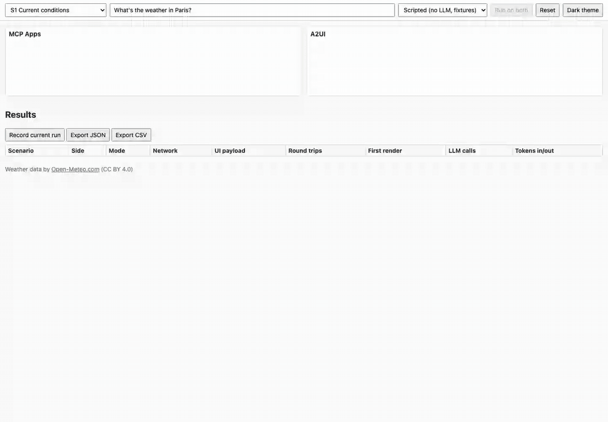

# MCP Apps vs A2UI: a measured comparison

*Snapshot of 2026-10-04. MCP Apps spec `2026-01-26` (stable) with
`@modelcontextprotocol/ext-apps` 2.0.3 and `mcp` 2.3.0 (Python). A2UI spec
v0.9.1 with `a2ui-agent-sdk` 0.7.0, `@a2ui/lit` 0.12.0 and `google-adk`
2.11.0. Exact pins in [docs/VERSIONS.md](docs/VERSIONS.md).*

The same weather app was built twice on a shared domain package (`core/`), then
both versions were run side by side with identical inputs in a test harness.
This page reports what was measured and what was observed. It does not pick a
winner: the two approaches answer different questions.

## In one minute

- **MCP Apps ships code, A2UI ships a description.** An MCP App view is a
  full HTML application sent by the server and run in a sandboxed iframe; an
  A2UI surface is a few KB of JSON rendered by components the client already
  has.
- **The network cost follows.** Per scenario, MCP Apps moved 237 to 421 KB
  (the self-contained views, about 61 KB each once gzipped) against 3 to
  10 KB for A2UI. The A2UI rendering code (785 KB raw, 230 KB gzip) is part
  of the client app instead, loaded once.
- **Layout ownership differs.** In MCP Apps the developer owns every pixel of
  the view and the host owns the frame around it; in A2UI the client owns
  the look and either the developer (designed surfaces) or the LLM (composed
  surfaces) owns the layout, within the client's catalog.
- **Off-script requests (S5) are where they split.** The MCP App can only
  repeat the single-city chart it was built with; the A2UI agent can compose
  a new two-city chart, at the price of a large schema in every prompt
  (about 8 K input tokens per LLM call in Live mode, against under 1 K on
  the MCP side), a slow composition (26 s for the S5 chart with Gemini) and
  output that has to be validated, and checked for correctness.
- **Interactivity costs about the same.** A click in either UI is one round
  trip to the backend with no LLM call; MCP Apps adds a few local
  host-to-view messages, A2UI can update data without touching the layout.

## Side by side

All recordings come from the comparison UI in Scripted mode (no LLM, recorded
Open-Meteo data), MCP Apps on the left, A2UI on the right, protocol inspector
open. Reproduce with `make gifs`.

**S2: ambiguous city, the click flows back.** Left: the view calls
`tools/call` through the host, then `ui/update-model-context`. Right: an A2UI
`action` goes to the agent, which replaces the picker in place.

**S3: forecast chart with in-UI controls.** Both re-query on "16 days" and
"°F" without a chat message. Right: the reply is a single `updateDataModel`.

**S4: world clock.** Clocks tick in the browser on both sides; the round-trip
counters do not move.

**S5: off-script ("Compare Paris and Tokyo over the next 7 days on one
chart").** Left: two separate single-city charts, the only view available.
Right: one composed chart. In Scripted mode the right side replays the
layout Gemini composed in a Live run (`scenarios/recorded/S5-a2ui-compose.json`,
validated against the catalog on replay; see the Live results below). The
values in that chart are the ones from the Live run (recorded on
2026-10-05), so they do not match the fixture data on the left, which
starts on 2026-10-04.

## Comparison matrix

| | MCP Apps | A2UI |
|---|---|---|
| What the server sends | A `ui://` HTML resource (view code) + tool results (data) | Declarative JSON messages: components + data |
| Who renders | The view itself, in a sandboxed iframe of the host | The client, with its own component catalog |
| Rendering code lives | On the server, shipped per view, per session | In the client app, shipped once |
| Security boundary | Iframe sandbox on a separate origin + CSP from `_meta.ui.csp` | No code crosses: only catalog components can appear |
| Look and feel | View's CSS, adapted with host CSS variables | Client's CSS variables, agent can only hint (`primaryColor`) |
| Layout owner | View developer | Surface developer, or the LLM for composed surfaces |
| Off-script request | Text, or the closest designed view | The LLM composes a new surface from the catalog |
| Custom widgets (chart, clock) | Any library inside the view | Add them to a custom catalog, on agent and client |
| User action path | View -> host -> `tools/call` -> server | Client -> A2A message (`action`) -> agent |
| Client-side state (ticking clock) | Plain JS in the view | A custom component in the catalog |
| Telling the model what happened | `ui/update-model-context` | Up to the agent (here: a note for the next turn) |
| Graceful degradation | Text `content` for hosts without MCP Apps | Text parts when the client does not activate the extension |
| Who brings the LLM | The host (Claude, ChatGPT, VS Code, ...) | The agent (here: ADK + Gemini) |

## Measurements

Method: Scripted mode, local machine, both backends on localhost, 10 runs per
scenario after one warm-up, medians reported. *Network* counts JSON bodies
between the UI and its backend (not HTTP headers or SSE framing, same rule on
both sides). *UI payload* is the part of it that describes UI: `ui://` HTML
plus `structuredContent` for MCP Apps, A2UI messages for A2UI. *Round trips*
are HTTP requests after connection setup. *First render* runs from sending the
prompt to the requested information being painted, measured the same way on
both sides (data applied, then two animation frames). Lines of code exclude
blank and comment-only lines, generated files and the shared `core/`.

<!-- measurements:start -->
Measured on 2026-10-04 (scripted mode, median of 10 runs after one warm-up; Darwin arm64, Node v25.4.0, Python 3.13.7). Reproduce with `make measure`.

**UI code size** (lines of code, blank and comment-only lines excluded; core/ is shared and not counted)

| Side | Role | LOC |
|---|---|---|
| MCP Apps | UI (ui:// views, TS + CSS + HTML) | 665 |
| MCP Apps | Server (tools, resources, transport) | 215 |
| **MCP Apps** | **total** | **880** |
| A2UI | UI (surface builders, catalog: Python + TS custom components) | 535 |
| A2UI | Agent (tools, prompt, executor, A2A server) | 554 |
| A2UI | Client app (A2A connection, chat shell) | 285 |
| **A2UI** | **total** | **1374** |
| Harness only (not product code) | Minimal MCP Apps host (what a real host provides) | 411 |
| **Harness only (not product code)** | **total** | **411** |

**Artifacts**

| Artifact | Raw | Gzip |
|---|---|---|
| MCP Apps view `current.html` (self-contained, sent per session) | 234.1 KB | 60.7 KB |
| MCP Apps view `forecast.html` (self-contained, sent per session) | 401.9 KB | 118.0 KB |
| MCP Apps view `world-clock.html` (self-contained, sent per session) | 233.6 KB | 60.6 KB |
| A2UI client bundle (renderer + catalog + A2A client, loaded once) | 784.9 KB | 229.8 KB |
| A2UI system prompt with the catalog schema (Live mode, every LLM call) | 28,443 chars | |

**Per scenario** (network = bytes on the wire between UI and backend, JSON bodies; UI payload = ui:// HTML + view data for MCP Apps, A2UI messages for A2UI; first render = from the prompt to the requested information painted)

| Scenario | Side | Network | UI payload | Round trips | Host-view messages | First render (p10-p90) |
|---|---|---|---|---|---|---|
| S1 | MCP Apps | 236.6 KB | 234.9 KB | 2 | 7 | 59 ms (57-70) |
| S1 | A2UI | 3.3 KB | 1.8 KB | 1 | 0 | 3 ms (3-4) |
| S2 | MCP Apps | 238.6 KB | 236.4 KB | 3 | 12 | 58 ms (55-59) |
| S2 | A2UI | 7.3 KB | 4.0 KB | 2 | 0 | 3 ms (2-3) |
| S3 | MCP Apps | 420.9 KB | 415.6 KB | 4 | 15 | 87 ms (70-91) |
| S3 | A2UI | 9.7 KB | 4.6 KB | 3 | 0 | 3 ms (3-5) |
| S4 | MCP Apps | 237.9 KB | 236.1 KB | 2 | 6 | 70 ms (56-72) |
| S4 | A2UI | 4.6 KB | 2.8 KB | 1 | 0 | 4 ms (3-6) |
| S5 | MCP Apps | 410.3 KB | 407.3 KB | 3 | 12 | 95 ms (88-107) |
| S5 | A2UI | 8.9 KB | 1.1 KB | 3 | 0 | 4 ms (2-5) |
<!-- measurements:end -->

How to read them:

- **Bytes.** Most of the MCP Apps payload is the view HTML: about 235 KB
  raw per view, of which the ext-apps App SDK (with zod) is nearly all; the
  app code is a few KB and Chart.js adds about 170 KB to the forecast view.
  Real hosts may serve it compressed (61 KB gzip) and cache or prefetch it
  (the `ui://` URI is known from `tools/list`); this harness caches per
  session only. The A2UI renderer is not free either, it simply lives in the
  client bundle, like a host's own code.
- **First render.** Locally, MCP Apps spends its 60 to 95 ms on creating the
  iframe, loading the sandbox proxy from a second origin, passing the HTML
  over `postMessage` and parsing it. A2UI renders in a few ms because the
  renderer is already loaded. On a real network both add the backend latency;
  MCP Apps also needs `resources/read`, sent in parallel with `tools/call`.
- **Round trips** are equal for clicks: one per action on each side. MCP
  Apps has one more per new view (`resources/read`), not on the critical path.
- **Code size.** A2UI needs more code in this repo because it includes a
  client app (A2A connection, chat), which a real MCP host provides for MCP
  Apps; the 411 lines of the harness's minimal MCP Apps host show what that
  host side costs when you have to build it.

## Findings

### Where it renders (what was actually tested)

- MCP Apps views were tested in the official ext-apps `basic-host` example
  (v2.0.3, built standalone and run with Node instead of Bun) and in this
  repo's minimal host. S1 to S4 worked in both, including the picker click,
  the forecast controls and host dark mode.
- **Real MCP hosts (Claude Desktop, claude.ai): not tested yet.** The server
  is ready for it (Streamable HTTP, `MCP_APPS_PUBLIC_HOST` for a tunnel).
  This section will be updated after the test; until then no compatibility
  with any real host is claimed.
- A2UI surfaces were tested with the official Lit renderer (`@a2ui/lit`
  0.12.0) in this repo's client and harness. Not tested: the Angular and
  React renderers, the ADK dev UI (which renders A2UI v0.8, not v0.9.1).

### Security model

MCP Apps assumes the UI code is untrusted and isolates it: the stable spec
requires a sandbox proxy on a different origin, and the host must enforce a
CSP built from what the resource declares (`connect-src`, `script-src`, ...)
without loosening it. Our views declare nothing, so they get `default-src
'none'` plus inline scripts and styles, no network. The view never touches
the host page, and every tool call it makes goes through the host, which can
refuse it (tool `visibility`). The cost is an extra origin to run, a
postMessage protocol to implement and a 235 KB document per view.

A2UI assumes the UI description is untrusted data and never runs it: the
client only instantiates components from its own catalog, validates messages
against their schemas, and the official renderer sanitizes Markdown with
DOMPurify. There is no iframe and no CSP to manage, but every capability the
agent may use must exist in the client beforehand, and a hostile agent can
still build a convincing fake form out of trusted components.

### Theming and brand consistency

Toggle the theme in the harness: on the left the host pushes its palette
through `ui/notifications/host-context-changed` and standard CSS variables,
and the views (written to use them) take the host's look, including its
purple accent; a view that ignored them would keep its own. On the right the
client's CSS variables restyle every surface, and the agent has no say beyond
a `primaryColor` hint. In short: MCP Apps views look like their author unless
they choose to follow the host; A2UI surfaces always look like the client.

### Who controls layout, and what happens off-script (S5)

With MCP Apps the developer designed three views; when asked for something
else, the host's LLM can only call the closest tool (twice here) or answer in
text. Nothing breaks, nothing new appears either.

With A2UI the same three layouts are designed surfaces, built by Python code
from tool results, and the LLM is told to compose a surface itself only when
none fits. That works, with caveats measured or observed here: the catalog
schema adds 28 K characters (about 8 K tokens) to every prompt, and
composing the S5 chart took 26 s with Gemini against 3 s for the MCP side's
first chart (Live results below); composed JSON must be validated
(the executor validates and retries once, invalid layouts are not shown); and
a valid layout can still be wrong. Open-Meteo returns each city's days from
its own local "today", so a Paris + Tokyo chart sharing one axis can be off
by one day, which schema validation cannot catch.

### Bidirectional events (S3)

Both sides re-query on "16 days" and "°F" without a chat message and without
the LLM. In MCP Apps the view calls `app.callServerTool(...)` and then
`app.updateModelContext(...)`, about 15 lines in the view, and the host
relays both. In A2UI the buttons carry an action whose context is bound to
the data model (`{"path": "/placeId"}`); the agent answers with a single
`updateDataModel` and the chart, bound to the same paths, redraws: about 10
lines of Python for the action handler, nothing on the client. Two
differences: in the A2UI basic catalog only `Button` emits actions (no
"onChange" for pickers or sliders), and a button cannot show a pressed state
because its variant is static.

### Developer experience

- *MCP Apps*: the Python SDK has the extension built in
  (`mcp.server.apps.Apps`), which made the server side short and validated
  (it refuses a tool linked to a missing resource). The views are ordinary
  web apps with a small SDK. Friction: the Python examples in ext-apps still
  import the renamed `FastMCP` and fail on `mcp` 2.x; `basic-host` needs Bun;
  ext-apps 2.x requires the split TS SDK and zod 4; and building a host is
  real work (sandbox origin, CSP, handshake, resize, theme).
- *A2UI*: the Python SDK is rich (typed builder, validation, prompt
  generator, A2A helpers) and the protocol is easy to read in a log.
  Friction: three spec versions in circulation (the codelab and ADK web use
  v0.8, the samples v0.9, the SDK supports 1.0), sample code still sending
  v0.8 names, a separate Markdown package needed for `Text`, zod 3 under the
  hood, a superset catalog to declare twice for any custom component, and
  shadow DOM vs light DOM differences between custom and basic components.

### Acknowledging the asymmetry

In real deployments the MCP Apps LLM belongs to the host (Claude, ChatGPT),
while the A2UI LLM belongs to the agent author. Comparing an ADK agent with a
third-party host would compare two LLM stacks. The harness removes that:

- **Scripted mode** has no LLM at all: both sides receive the same tool calls
  and the same clicks on the same recorded data, so every number above is
  protocol and UI cost only.
- **Live mode** sends the same prompt to both sides with the same Gemini
  model: the MCP side runs a small agent loop of its own over the MCP tools,
  in place of a host's LLM.

**Live mode results** (`make measure ARGS="--mode live --runs 3"`, live
Open-Meteo data, so the numbers vary more than in Scripted mode):

<!-- measurements-live:start -->
Measured on 2026-10-05 (live mode, median of 3 runs after one warm-up; Darwin arm64, Node v25.4.0, Python 3.13.7). Reproduce with `make measure ARGS="--mode live --runs 3"`.

**Per scenario** (network = bytes on the wire between UI and backend, JSON bodies; UI payload = ui:// HTML + view data for MCP Apps, A2UI messages for A2UI; first render = from the prompt to the requested information painted)

| Scenario | Side | Network | UI payload | Round trips | Host-view messages | First render (p10-p90) |
|---|---|---|---|---|---|---|
| S1 | MCP Apps | 236.6 KB | 235.0 KB | 2 | 7 | 1112 ms (1001-1746) |
| S1 | A2UI | 3.6 KB | 1.8 KB | 1 | 0 | 1311 ms (1226-1492) |
| S2 | MCP Apps | 238.6 KB | 236.4 KB | 3 | 13 | 1125 ms (1092-1355) |
| S2 | A2UI | 7.4 KB | 4.0 KB | 2 | 0 | 1292 ms (1229-2459) |
| S3 | MCP Apps | 421.0 KB | 415.8 KB | 4 | 15 | 1169 ms (812-1224) |
| S3 | A2UI | 9.4 KB | 4.6 KB | 3 | 0 | 1292 ms (1199-2487) |
| S4 | MCP Apps | 237.9 KB | 236.1 KB | 2 | 7 | 1042 ms (910-1816) |
| S4 | A2UI | 4.6 KB | 2.8 KB | 1 | 0 | 1424 ms (1266-1426) |
| S5 | MCP Apps | 410.2 KB | 407.3 KB | 3 | 12 | 3078 ms (1930-3204) |
| S5 | A2UI | 2.5 KB | 1.1 KB | 1 | 0 | 26358 ms (26251-27081) |

| Scenario | Side | LLM calls | Input tokens | Output tokens |
|---|---|---|---|---|
| S1 | MCP Apps | 2 | 1702 | 27 |
| S1 | A2UI | 2 | 16650 | 27 |
| S2 | MCP Apps | 2 | 1735 | 27 |
| S2 | A2UI | 2 | 16711 | 28 |
| S3 | MCP Apps | 2 | 1914 | 28 |
| S3 | A2UI | 2 | 16895 | 28 |
| S4 | MCP Apps | 2 | 1829 | 43 |
| S4 | A2UI | 2 | 16889 | 45 |
| S5 | MCP Apps | 2 | 2603 | 57 |
| S5 | A2UI | 3 | 36283 | 1622 |
<!-- measurements-live:end -->

How to read them:

- **Latency is the model's.** For S1 to S4 both sides take one to one and a
  half seconds, nearly all of it two Gemini calls (pick the tool, then answer
  in text); the UI renders as soon as the tool returns, before the second
  call ends. The protocol differences of the Scripted table (tens of ms) are
  lost in that noise.
- **Tokens differ by an order of magnitude.** Each A2UI call carries the
  catalog schema and composition rules (about 8 K input tokens, paid even
  when a designed surface is used, because the model must be able to compose
  at any turn); the MCP side's loop only sends tool definitions. Caveat: a
  real MCP host has its own, much larger system prompt; what is compared here
  is what each approach adds.
- **S5 is the expensive case.** The A2UI agent fetched both forecasts, then
  generated about 1.6 K output tokens of A2UI JSON: 26 s before anything is
  painted, against 3 s for the first MCP chart (which then shows only one
  city per chart). The recorded composition was valid on the first try;
  the measured runs were not instrumented for retries (every one made 3 LLM
  calls, the recording 2).
- Clicks never involve the LLM on either side, so their cost matches Scripted
  mode.

### Spec gaps and how they were handled

- *A2UI, no chart or clock component*: custom catalog (basic + `Chart` +
  `Clock`), declared in `a2ui/agent/.../catalog.py` and
  `a2ui/client/src/catalog.ts`.
- *A2UI, only buttons emit actions*: the picker and the controls are
  buttons.
- *A2UI, no timer*: the S4 weather is not refreshed every 15 minutes on the
  A2UI side (the MCP view does it); doing it would need another custom
  component that emits an action.
- *MCP Apps, render timing*: the view's startup `size-changed` can reach the
  host after the tool result, so it cannot be used as a render signal; the
  harness pings the view instead (excluded from the counts).

## When to pick which

- **Pick MCP Apps** when the UI is a product in its own right (rich, custom,
  branded, using any web library), when you want it to work in hosts you do
  not control (chat assistants, IDEs), and when the host's LLM should stay in
  charge of the conversation.
- **Pick A2UI** when you own the client and want consistent look and feel,
  small payloads, no third-party code in your page, and an agent that can
  assemble UI for requests nobody designed for, accepting that the agent
  needs validation and its own LLM.
- **Either works** for forms, cards and simple controls, where both cost one
  round trip per interaction and a comparable amount of code.
