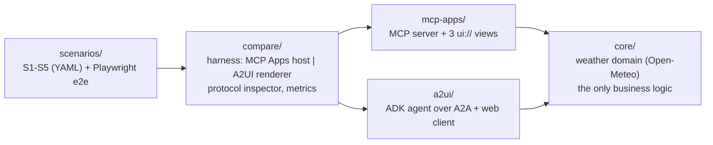

# MCP Apps vs A2UI, compared

The same weather app built twice, once with **MCP Apps** and once with
**A2UI** (Google ADK), on one shared domain package, then run side by side
with identical inputs to compare the two approaches to agent-driven UI.
Results, numbers and a decision guide: **[COMPARISON.md](COMPARISON.md)**.


## The two approaches in one line each

- **MCP Apps**: the MCP server ships ready-made HTML views (`ui://`
  resources) linked to tools via `_meta.ui`; the host renders them in a
  sandboxed iframe and relays tool inputs, results and user actions over
  JSON-RPC (`postMessage`).
- **A2UI**: the agent emits declarative JSON describing UI components (no
  code); the client renders them with its own trusted component catalog and
  sends user actions back to the agent.

## What is in the repo



Five scenarios run on both sides: current weather card (S1), ambiguous city
with a picker whose click must reach the backend (S2), forecast chart with
in-UI controls (S3), multi-city world clock ticking client-side (S4), and an
off-script request no view was designed for (S5). Details in
[docs/ARCHITECTURE.md](docs/ARCHITECTURE.md).

## Quickstart

Requirements: [uv](https://docs.astral.sh/uv/), Node 24+, `make`. Optional:
Gemini credentials for Live mode, `ffmpeg` for GIFs.

```bash
make install          # Python 3.13 workspace (uv) + npm workspaces
cp .env.example .env  # optional: Gemini settings for Live mode
make compare          # both backends (Scripted + Live) and the UI
```

Open http://localhost:8080, pick a scenario and press **Run on both**.
Scripted mode needs no API key and no network: tool calls are replayed on
recorded Open-Meteo data, and clicks are yours (the banner lists them).
Add `?side=mcp` or `?side=a2ui` to show one side full width.

| Command | What it does |
|---|---|
| `make mcp-apps` | MCP Apps server alone on :3001 (live data) |
| `make a2ui` | A2UI agent on :10002 + standalone client on :5174 |
| `make compare` | Comparison UI on :8080 with Scripted and Live backends |
| `make test` | Python tests (core, MCP server, A2UI agent) + harness unit tests |
| `make e2e` | Playwright on both panes, Scripted mode |
| `make measure` | Medians of N runs per scenario into `docs/measurements.md` |
| `make gifs` | Re-record the side-by-side GIFs |
| `make lint typecheck` | ruff, eslint, prettier, mypy, tsc |

Live mode uses the same Gemini model on both sides (`AGENT_MODEL`, default
`gemini-3.8-flash`), on Google Cloud (Application Default Credentials) or
with a Gemini API key: see `.env.example`.

### Try the MCP Apps server in a real host

Expose port 3001 with a tunnel (for example `ngrok http 3001`), set
`MCP_APPS_PUBLIC_HOST` to the tunnel host name in `.env`, run `make mcp-apps`,
then add `https://<tunnel host>/mcp` to your MCP client (as a custom
connector, or through `npx mcp-remote <url>` for Claude Desktop). Tested with Claude Desktop; results in
[COMPARISON.md](COMPARISON.md#where-it-renders-what-was-actually-tested).

## Versions

Specs and SDKs move fast; everything is pinned. MCP Apps spec `2026-01-26`
(ext-apps 2.0.3, `mcp` 2.3.0), A2UI v0.9.1 (`a2ui-agent-sdk` 0.7.0,
`@a2ui/lit` 0.12.0), Google ADK 2.11.0. See [docs/VERSIONS.md](docs/VERSIONS.md).

## Data and license

Weather data by [Open-Meteo.com](https://open-meteo.com/) (CC BY 4.0), free
for non-commercial use; responses are cached and S4 clocks tick locally to
keep the call volume low. Code under the [MIT license](LICENSE), Baptiste
PIRAULT. The weather tools are adapted from
[adk_quickstart](https://github.com/batou9150/adk_quickstart) (same author,
MIT).

This is a demo to learn and compare, not a production system: no auth, no
multi-tenancy, no hardening beyond basic sanity.
