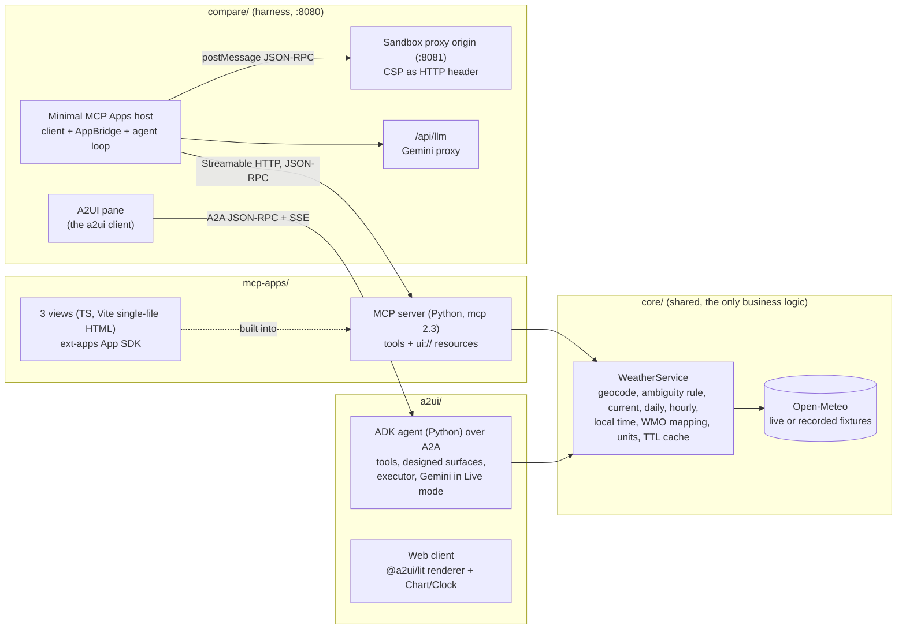
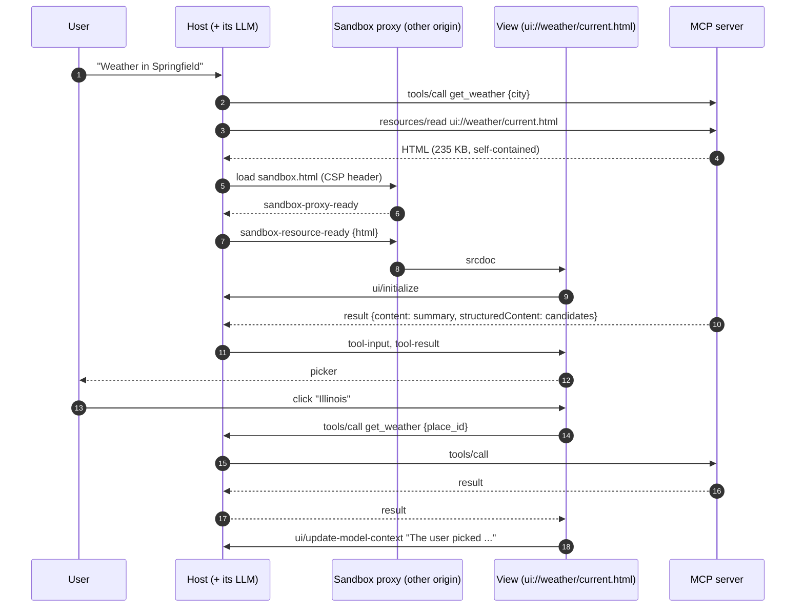
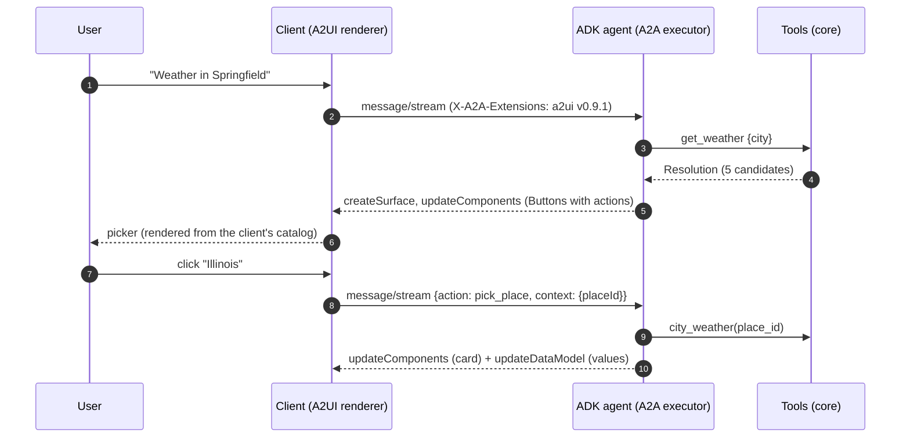
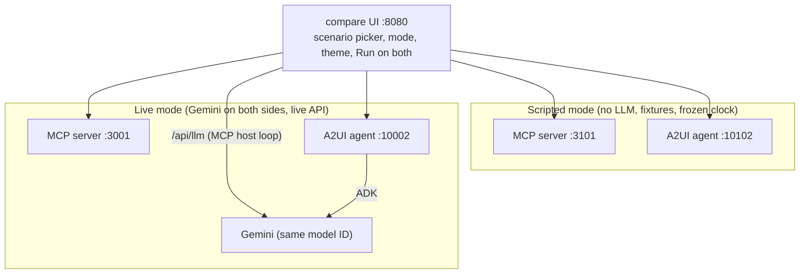

# Architecture

One weather domain, two UI protocols, one harness to compare them.

## Rule of the repo

Business logic lives only in `core/`. Both implementation folders hold
protocol and UI code only: both servers call the same `WeatherService`
methods and receive the same Pydantic models. The ambiguity rule ("Springfield"
needs a picker, "Paris" does not), unit conversion and day slicing are in
core, so the 3/7/16 days and °C/°F controls never trigger a new Open-Meteo
call on either side.

## MCP Apps: the server ships the UI

Each UI tool carries `_meta.ui.resourceUri` pointing to a `ui://` resource
(`text/html;profile=mcp-app`). The host reads the HTML, renders it in a
sandboxed iframe, and relays tool input and results to it over JSON-RPC on
`postMessage`. The view can call tools back through the host.

## A2UI: the agent describes the UI

The agent sends declarative JSON messages (`createSurface`,
`updateComponents`, `updateDataModel`) as A2A DataParts. The client renders
them with its own trusted component catalog and sends user actions back as
A2A messages.

In Live mode the agent runs Gemini: tools that have a designed surface render
it as soon as they return (the model only reads the text summary, as with MCP
Apps); for requests no surface was designed for, the model composes a layout
itself in A2UI JSON, validated against the catalog with one retry. User
actions never go through the model: they are handled by the executor, like
an MCP App view calling a tool directly.

## The weather catalog (A2UI)

The A2UI basic catalog has no chart and no clock, and a surface declares a
single `catalogId`. The repo therefore defines one catalog, the basic one
plus `Chart` and `Clock`, twice: as JSON Schema on the agent side (prompt and
validation, `a2ui/agent/src/a2ui_agent/catalog.py`) and as zod schemas + Lit
elements on the client (`a2ui/client/src/catalog.ts`).

## The comparison harness

- **Scripted**: each scenario (`scenarios/*.yaml`) lists the tool calls to
  replay and the clicks to perform. The MCP pane sends real `tools/call`; the
  A2UI pane sends the same call as message metadata, which the executor runs
  without the LLM. Both backends read the same fixtures. Clicks are real
  clicks in the rendered UI (Playwright or a human).
- **Live**: the prompt goes to both sides. The MCP pane runs its own small
  agent loop over the MCP tools (`compare/src/mcp/agent.ts`), calling the
  same Gemini model as the ADK agent through a server-side proxy.
- **Inspector**: every message is logged with direction, size and time:
  JSON-RPC to the MCP server, host-view `postMessage` traffic, A2A envelopes,
  A2UI messages and actions. Metrics are computed from that log.

## What the minimal MCP Apps host does not do

Compared with real hosts (Claude, ChatGPT, VS Code, ...): inline display mode
only, no `ui/open-link`, no `ui/message` from views, no permissions (camera,
microphone, ...), no view-registered tools or sampling (draft spec), no
resource caching across sessions, no persistence. It does implement the
stable spec's security model: separate sandbox origin, CSP built from
`_meta.ui.csp` and sent as a header, and tool visibility filtering.
